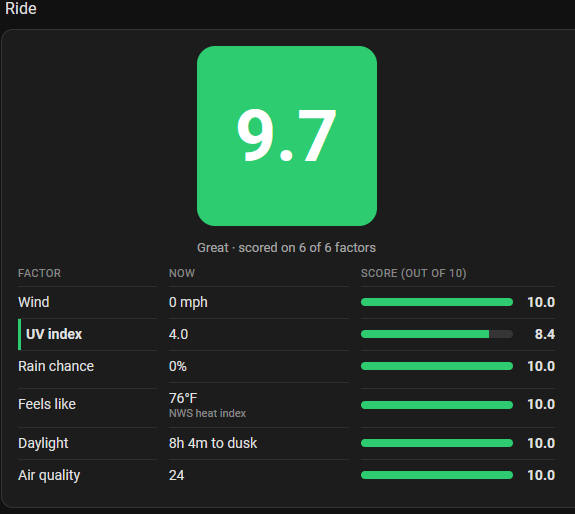

# Ride Quality Index for Home Assistant

A single 0-10 score for how good conditions are for a bike ride right now, with a dashboard card that shows exactly how the score was reached.



## What it does

Every minute, Home Assistant rates six weather factors from 0 to 10 and combines them into a weighted average. Hard stops override the average for conditions that make a ride unsafe (nearby lightning, darkness) or miserable (rain falling now). If a data source stops reporting, that factor is dropped and flagged rather than silently scored as fine.

The card shows:

- the score in a large tile, colored by band;
- a table of each factor: its current reading, where the reading came from, and its own 0-10 rating;
- any hard stop or data warning above the table, with the factor pulling the score down most marked as limiting;
- optionally, Garmin training readiness beside it.

## How the score works

| Factor | Weight | Scores 10 | Scores 7 | Scores 4 | Scores 1 |
|---|---|---|---|---|---|
| Wind (sustained) | 25 | 4 mph or less | 8 mph | 12 mph | 15 mph or more |
| UV index | 20 | 3 or less | 5 | 7 | 9 or more |
| Rain chance, next 2 hours | 20 | 20% or less | 40% | 60% | 80% or more |
| Feels-like temperature | 15 | 60-78°F | 50°F / 85°F | 40°F / 92°F | 30°F / 100°F |
| Daylight left | 15 | 2+ hours before civil dusk, sliding to 0 at dusk |||
| Air quality (AQI) | 5 | 50 or less | 100 | 150 | 200 or more |

Ratings slide in a straight line between these points rather than jumping, so 6 mph of wind scores 8.5, halfway between 10 at 4 mph and 7 at 8 mph.

Wind gusts are deliberately not scored; sustained wind is what you ride into.

The rain factor averages the forecast rain chance for the current hour and the next one, so a storm arriving in 90 minutes still counts.

Civil dusk is when the sun is 6° below the horizon and it's too dark to ride without lights.

Score bands on the card: **8-10 Great** (green), **6-8 Good** (blue), **4-6 Fair** (amber), **below 4 Poor** (red).

### Hard stops

| Condition | Result |
|---|---|
| Lightning within 15 miles in the last 30 minutes | Score 0, No-go |
| After civil dusk (or before dawn) | Score 0, No-go |
| Rain falling right now | Score capped at 3 |
| Less than 2 hours to civil dusk | Score capped at the daylight rating + 1.5 |

The daylight cap stops a perfect-weather evening from reading Great with no time left to ride. With 1 hour to dusk the score can't go above 6.5 (Good); with 30 minutes, 4.0; with 10 minutes, 2.3. The card shows a note when the cap is holding the score down.

The lightning stop needs a lightning distance sensor such as [Blitzortung](https://github.com/mrk-its/homeassistant-blitzortung). Without one, there is no lightning stop.

### Missing and stale data

Each source has a maximum age. A reading older than that counts as missing, so a sensor that has stopped updating can't keep reporting yesterday's calm wind.

- Each factor can have several sources, tried in order. If the first is missing or stale, the next is used, and the card shows which one.
- If every source for a factor is missing, that factor is dropped, the other weights scale up to cover it, and the card shows why ("Wind unavailable (NWS 200m old, OWM missing)") and "scored on 5 of 6 factors".
- If wind and rain chance are both missing, there is no score ("Not enough data"). They carry the most weight, and a score without them would be misleading.
- If the lightning sensor goes unavailable, the card says so. A lightning source that is down is never treated as clear skies.
- If the forecast can't be fetched, the last good rain chance is kept for up to 2 hours, then counted as missing.

### Feels-like temperature

The feels-like reading is chosen in this order:

1. A heat index or wind chill, when the weather service reports one (NWS only reports these when they apply).
2. Your local outdoor sensor, if you configure one.
3. The weather service's temperature, then any backups you list.

Local sensors in direct sun can read far above the real air temperature. If yours reads more than 5°F above the weather service, the service's reading is used instead and the card shows a warning.

## Requirements

- Home Assistant 2024.10 or newer.
- [button-card](https://github.com/custom-cards/button-card), installed through HACS.
- At least one weather integration whose **hourly** forecast includes `precipitation_probability`. The [National Weather Service](https://www.home-assistant.io/integrations/nws/) (US only) and [OpenWeatherMap](https://www.home-assistant.io/integrations/openweathermap/) in One Call mode both do. Some others, including the Home Assistant default Met.no, may only provide rainfall amounts. To check yours, go to **Developer Tools > Actions**, run `weather.get_forecasts` with type `hourly`, and look for `precipitation_probability` in the result.
- Sensors for wind speed, UV index and temperature. The NWS and OpenWeatherMap integrations provide these.

Optional:

- An air quality index sensor (e.g. [WAQI](https://www.home-assistant.io/integrations/waqi/)).
- A lightning distance sensor (e.g. Blitzortung).
- A local outdoor temperature sensor.
- The [Garmin Connect](https://github.com/cyberjunky/home-assistant-garmin_connect) HACS integration, for the readiness panel.

Readings in km/h, m/s, knots, °C and km are converted automatically. The thresholds and the card use mph and °F.

## Installation

### 1. Enable packages

If your `configuration.yaml` doesn't already load packages, add:

```yaml
homeassistant:
  packages: !include_dir_named packages
```

If you already have a `homeassistant:` section, add the `packages:` line inside it rather than creating a second one.

### 2. Add the two package files

Create a `packages` folder next to `configuration.yaml` and copy in:

- `packages/ride_index.yaml`: fetches the forecast and calculates the 2-hour rain chance (`sensor.ride_rain_chance_2h`).
- `packages/ride_score.yaml`: calculates the score (`sensor.ride_quality_index`).

### 3. Edit the configuration blocks

Each file has a block marked `CONFIGURATION` near the top. Replace every `replace_me` entity with your own. To find an entity ID, open the sensor in **Settings > Devices & services > Entities** and copy the ID shown in its settings.

In `ride_index.yaml`:

| Setting | What goes there |
|---|---|
| `primary_weather` | Your main weather entity, e.g. `weather.kxyz` from NWS |
| `fallback_weather` | A second weather entity, or `""` if you only have one |
| `primary_label`, `fallback_label` | Short names shown on the card |

In `ride_score.yaml`, each factor takes a list of sources tried in order:

```yaml
wind_sources:
  - entity: sensor.kxyz_wind_speed   # your sensor
    label: NWS                        # shown on the card
    max_age_min: 120                  # older readings count as missing
```

- Set a factor's list to `[]` to leave it out; the other weights scale up to cover it.
- Leave `local_temp_entity`, `lightning_entity` and `rain_rate_entity` as `""` if you don't have them.
- An entity ID with a typo shows up on the card as that source "missing", so mistakes are easy to spot.

### 4. Check and restart

Go to **Developer Tools > YAML**, click **Check configuration**, and restart Home Assistant. A restart is only needed the first time; after later edits to the package files, reload **Template entities** on the same page instead.

The score appears within a minute. The rain chance may read "no forecast yet" for up to 10 minutes after a restart, while the weather integration loads.

### 5. Add the card

Edit your dashboard, click **Add card**, choose **Manual**, and paste the contents of `card/ride_card.yaml`.

For the Garmin panel, change `var SHOW_GARMIN = false;` to `true` in the card's configuration block. The entity IDs listed there are the Garmin Connect integration's defaults. The readiness values are shown for context and don't affect the weather score.

The card works best in a section at least two columns wide, where the Garmin panel sits beside the score. In a narrow section it stacks underneath.

## Tuning

The weights and band points are set in one block in `ride_score.yaml`, marked `TUNING`:

```jinja


```

- **Weights** are relative and don't need to add up to 100.
- **Band points** are `[reading, score]` pairs. Scores slide between points and hold flat beyond the first and last.
- The same block sets the lightning distance and time window, the rain-now cap, how long before dusk daylight starts losing points, and the daylight cap margin (`DAY_MARGIN`).

After editing, reload **Template entities**. A few weeks of noting where the score disagreed with how a ride actually felt is the best guide to adjusting it.

## Sensor attributes

`sensor.ride_quality_index` has these attributes, for use in automations or your own cards:

| Attribute | Example |
|---|---|
| `status` | Great, Good, Fair, Poor, No-go, Not enough data |
| `hard_stop` | "After dusk", or empty |
| `lines` | The per-factor breakdown the card displays |
| `scored_on` | "5 of 6" |
| `limiting` | The factor with the lowest rating |
| `lightning_data` | ok, unavailable, or not configured |

`sensor.ride_rain_chance_2h` records which source it used (`source`), when it last fetched successfully (`fetched_at`), and both sources' values (`primary_2h`, `fallback_2h`), which helps when they disagree.

## Known limitations

- **Forecast sources can disagree.** One service may forecast 60% rain while another says 0%. The primary source wins; the fallback is only used when the primary fails. Both values are stored on the rain sensor so you can see how often it happens.
- **Rain chance is for your forecast area**, not your exact route.
- **Lightning timing is approximate.** Blitzortung doesn't record strike times, so the time the distance sensor last updated is used instead.
- **The daylight factor and dusk stop assume you ride without lights.** There's no setting yet to turn the dusk stop off for night riders.
- **Thresholds and display are in mph and °F.** Metric readings are converted, but the card shows US units.

## License

MIT. See [LICENSE](LICENSE).
